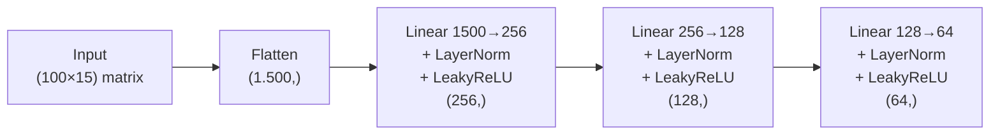
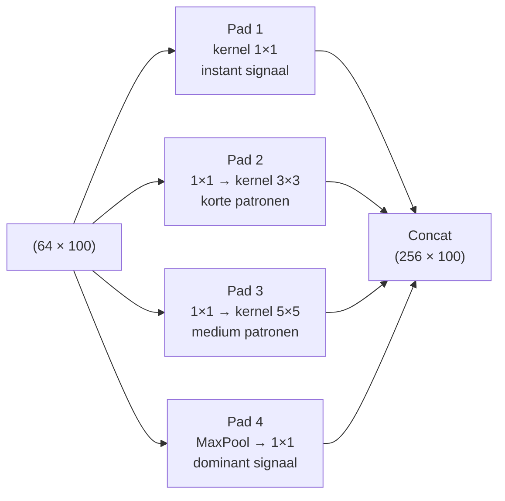
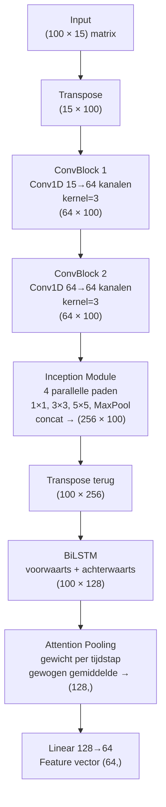
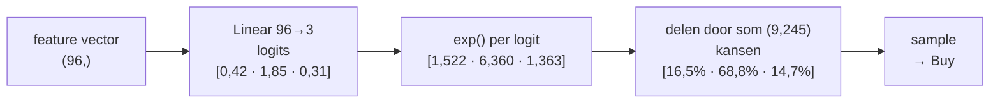
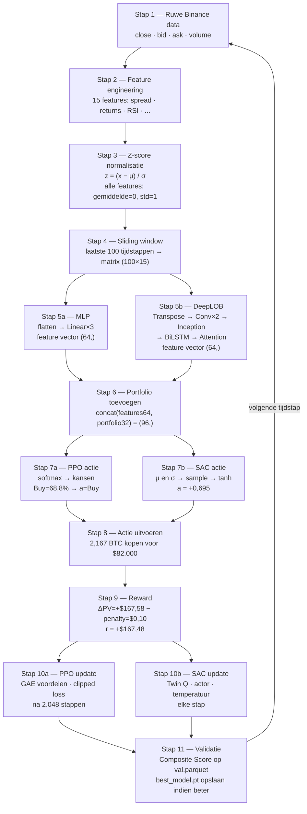

# Algoritmen & Dataverwerking — Volledig Stap voor Stap

Dit document legt uit wat er precies met de data gebeurt, van het moment dat
ruwe Binance-koersdata binnenkomt tot het moment dat het model een
handelsbeslissing neemt en van die beslissing leert.

Elke stap krijgt eerst een uitleg in gewone taal, dan de formule, dan een
concreet rekenvoorbeeld.

---

# DEEL 1 — VAN RUWE DATA NAAR MODELINPUT

---

## Stap 1 — Ruwe data: wat komt er binnen?

Binance registreert elke seconde een snapshot van de BTC/USDT markt.
Eén zo'n snapshot ziet er zo uit:

```
Tijdstip t = 5.000   (de 5.000e seconde in de dataset)

close       = 37.842,50 USDT   ← prijs van de laatste uitgevoerde trade
bid_price   = 37.841,00 USDT   ← hoogste prijs die iemand wil betalen
ask_price   = 37.843,00 USDT   ← laagste prijs waarvoor iemand wil verkopen
bid_volume  =  2,40 BTC        ← hoeveel BTC men wil kopen op die prijs
ask_volume  =  1,80 BTC        ← hoeveel BTC men wil verkopen op die prijs
volume      =  0,45 BTC        ← totaal verhandeld in dit tijdvenster
```

**Wat betekent dit?**
De bid en ask zijn de twee kanten van de markt. Als jij nu BTC wilt kopen,
betaal je de ask: $37.843. Als je wilt verkopen, ontvang je de bid: $37.841.
Dat verschil van $2 heet de spread — de kosten van direct handelen.

---

## Stap 2 — Feature engineering: ruwe data omzetten naar signalen

Ruwe prijzen zijn moeilijk direct bruikbaar voor een neuraal netwerk.
Een prijs van $37.842 vandaag betekent iets heel anders dan $37.842 in 2017.
Daarom berekenen we 15 afgeleide features die marktgedrag beschrijven
onafhankelijk van het absolute prijsniveau.

---

### Feature 1 — Spread

**Wat het is:** Het verschil tussen koop- en verkoopprijs. Hoe kleiner de spread,
hoe goedkoper en makkelijker het is om te handelen.

```
Formule:   spread = ask_price − bid_price

Berekening:
  spread = 37.843,00 − 37.841,00 = 2,00 USDT
```

---

### Feature 2 — Spread percentage

**Wat het is:** De spread uitgedrukt als percentage van de prijs.
Hierdoor is de waarde vergelijkbaar ongeacht het prijsniveau.

```
Formule:   spread_pct = spread / close × 100

Berekening:
  spread_pct = 2,00 / 37.842,50 × 100 = 0,0053%
```

Een spread van 0,005% is klein — de markt is liquide.
Bij 0,1% is de markt onrustig en is handelen duur.

---

### Feature 3 — Buy ratio

**Wat het is:** Van alle trades in dit tijdvenster, welk percentage werd
gestart door een koper (niet een verkoper)? Meer kopers dan verkopers
duidt op opwaartse druk.

```
Formule:   buy_ratio = aantal_koper_trades / totaal_trades

Berekening:
  buy_ratio = 62 / 100 = 0,62
```

Een waarde van 0,5 is neutraal. Boven 0,5 domineren kopers.
Hier: 62% koopdruk → de markt neigt naar omhoog.

---

### Features 4 t/m 7 — Returns over meerdere tijdschalen

**Wat het is:** Hoeveel heeft de prijs bewogen over de afgelopen N seconden?
We berekenen dit voor 4 tijdschalen zodat het model zowel de directe
beweging als de langere trend tegelijk ziet.

```
Formule:   return_Ns = (close_t − close_{t−N}) / close_{t−N}

Symbolen:
  close_t      = de prijs nu (op tijdstip t)
  close_{t−N}  = de prijs N seconden geleden
  N            = hoeveel seconden je terugkijkt (5, 10, 30 of 60)

Hoe pas je het toe:
  1. Neem de huidige prijs.
  2. Trek de prijs van N seconden geleden ervan af → de verandering.
  3. Deel door de oude prijs → de verandering als fractie (procentueel).
  Positief = prijs gestegen, negatief = gedaald.

Berekening:
  close nu          = 37.842,50

  close 5 sec geleden   = 37.830,00
  return_5s  = (37.842,50 − 37.830,00) / 37.830,00 = +0,000330  (+0,033%)

  close 10 sec geleden  = 37.810,00
  return_10s = (37.842,50 − 37.810,00) / 37.810,00 = +0,000860  (+0,086%)

  close 30 sec geleden  = 37.800,00
  return_30s = (37.842,50 − 37.800,00) / 37.800,00 = +0,001124  (+0,112%)

  close 60 sec geleden  = 37.750,00
  return_60s = (37.842,50 − 37.750,00) / 37.750,00 = +0,002450  (+0,245%)
```

**Waarom geen absolute prijs als feature?**
In 2017 stond BTC op $5.000, in 2024 op $65.000. Als we de absolute prijs
gebruiken, heeft het model tijdens training nooit die hoge waarden gezien
en kan het niet generaliseren naar latere data. Een return van +0,03%
betekent hetzelfde in 2017 als in 2024 — dat is wél bruikbaar.

---

### Features 8 t/m 10 — Volatiliteit

**Wat het is:** Hoe sterk schommelt de prijs van seconde tot seconde?
We berekenen de standaarddeviatie van de seconde-returns over een rollend venster.
Hoge volatiliteit = grote onzekerheid.

```
Formule:   volatility_N = standaarddeviatie(return_1s, venster = N)

Symbolen:
  return_1s = de prijsverandering van seconde tot seconde
  venster N = over hoeveel seconden je de spreiding meet (10, 30 of 60)
  standaarddeviatie = maat voor hoe ver waarden van hun gemiddelde afwijken

Hoe pas je het toe:
  1. Neem de laatste N seconde-returns.
  2. Bereken hun gemiddelde.
  3. Meet hoe ver elke return van dat gemiddelde ligt (kwadrateer dat).
  4. Neem de wortel van het gemiddelde van die kwadraten.
  Grote uitkomst = onrustige markt, kleine uitkomst = stabiele markt.

De laatste 10 seconde-returns (return_1s):
  [−0,0001, +0,0003, +0,0002, −0,0001, +0,0004,
   +0,0001, +0,0003, −0,0002, +0,0002, +0,0003]

Standaarddeviatie = hoe ver wijken de waarden af van het gemiddelde?
  gemiddelde = (+0,0001 + ... ) / 10 = +0,000140
  afwijkingen: (−0,0001 − 0,000140)² + ... = som van kwadraten
  std = √(som / 10) = 0,000195

  volatility_10 = 0,000195
  volatility_30 = 0,000312   (berekend over 30 seconden)
  volatility_60 = 0,000287   (berekend over 60 seconden)
```

Lage volatiliteit (zoals hier) = stabiele markt, makkelijker te voorspellen.

---

### Features 11 & 12 — Momentum

**Wat het is:** Absolute prijsverandering over N seconden (niet procentueel).
Dit geeft de kracht van de beweging in dollars weer.

```
Formule:   momentum_N = close_t − close_{t−N}

Symbolen:
  close_t      = de prijs nu
  close_{t−N}  = de prijs N seconden geleden
  N            = aantal seconden terug (10 of 30)

Hoe pas je het toe:
  Trek simpelweg de oude prijs af van de huidige prijs. Het verschil
  is de absolute beweging in dollars (anders dan return, dat een
  percentage is). Groot positief getal = sterke opwaartse beweging.

Berekening:
  momentum_10 = 37.842,50 − 37.810,00 = +32,50 USDT
  momentum_30 = 37.842,50 − 37.800,00 = +42,50 USDT
```

Sterk positief momentum over meerdere tijdschalen bevestigt een
opwaartse trend.

---

### Feature 13 — RSI-14 (Relative Strength Index)

**Wat het is:** Een klassieke technische indicator die meet of de markt
"overkocht" (te ver gestegen) of "oververkocht" (te ver gedaald) is.
De RSI loopt van 0 tot 100. Boven 70 = overkocht. Onder 30 = oververkocht.

```
Symbolen:
  Δ_t   = de prijsverandering tussen twee opeenvolgende seconden
  gain  = gemiddelde van alle stijgingen over 14 perioden
  loss  = gemiddelde van alle dalingen (absolute waarde) over 14 perioden
  RS    = "Relative Strength" = verhouding gain/loss
  RSI   = de uiteindelijke indicator op schaal 0-100

Stap 1 — Bereken per seconde de prijsverandering:
  Δ_t = close_t − close_{t−1}

Stap 2 — Splits in winsten en verliezen over 14 perioden:
  gain = gemiddelde van alle Δ_t > 0   = 0,00028
  loss = gemiddelde van alle |Δ_t| < 0 = 0,00008

Stap 3 — Bereken de verhouding:
  RS = gain / loss = 0,00028 / 0,00008 = 3,5

Stap 4 — Omzetten naar 0-100 schaal:
  RSI = 100 − (100 / (1 + RS))
      = 100 − (100 / (1 + 3,5))
      = 100 − (100 / 4,5)
      = 100 − 22,2
      = 77,8

Hoe pas je het toe:
  Veel stijgingen en weinig dalingen → RS groot → RSI dicht bij 100
  (overkocht). Veel dalingen → RS klein → RSI dicht bij 0 (oververkocht).
  De +1 in de noemer voorkomt delen door nul als er geen verliezen zijn.
```

RSI van 77,8 → de markt is overkocht. Er is kans op een neerwaartse
correctie ondanks de positieve trend die we eerder zagen.

---

### Feature 14 — Volume ratio

**Wat het is:** Is het huidige volume hoger of lager dan normaal?
We vergelijken met het gemiddelde volume van de afgelopen 10 perioden.

```
Formule:   volume_ratio = volume_t / gemiddeld_volume(venster=10)

Berekening:
  gemiddeld_volume_10 = 0,38 BTC
  volume_ratio = 0,45 / 0,38 = 1,18
```

1,18 betekent: 18% meer volume dan normaal. Verhoogde activiteit.

---

### Feature 15 — Order imbalance

**Wat het is:** Is er meer koopdruk of verkoopdruk op de beste prijs?
We vergelijken de hoeveelheid BTC die men wil kopen (bid) met de
hoeveelheid die men wil verkopen (ask).

```
Formule:   order_imbalance = (bid_volume − ask_volume) / (bid_volume + ask_volume)

Symbolen:
  bid_volume = hoeveel BTC men wil kopen op de beste prijs
  ask_volume = hoeveel BTC men wil verkopen op de beste prijs

Hoe pas je het toe:
  De teller (bid − ask) is positief bij meer koopdruk, negatief bij
  meer verkoopdruk. De noemer (bid + ask) schaalt de uitkomst altijd
  naar het bereik [−1, +1], zodat het vergelijkbaar is ongeacht de
  absolute volumes. 0 = perfect in balans.

Berekening:
  order_imbalance = (2,4 − 1,8) / (2,4 + 1,8)
                  = 0,6 / 4,2
                  = +0,143
```

Positief = meer koopdruk. Negatief = meer verkoopdruk. Hier licht positief.

---

### Resultaat na feature engineering

```
Feature          Berekende waarde   Signaal
─────────────────────────────────────────────────────────
spread           2,00 USDT          Liquide markt
spread_pct       0,0053%            Goedkoop te handelen
buy_ratio        0,62               Meer kopers dan verkopers
return_5s        +0,000330          Korte stijging
return_10s       +0,000860          Sterkere stijging
return_30s       +0,001124          Aanhoudende stijging
return_60s       +0,002450          Duidelijke minuut-trend omhoog
volatility_10    0,000195           Stabiel (laag)
volatility_30    0,000312           Stabiel
volatility_60    0,000287           Stabiel
momentum_10      +32,50 USDT        Stijging afgelopen 10 sec
momentum_30      +42,50 USDT        Sterkere stijging afgelopen 30 sec
rsi_14           77,8               Overkocht — let op correctie
volume_ratio     1,18               Meer activiteit dan normaal
order_imbalance  +0,143             Lichte koopdruk
```

---

## Stap 3 — Z-score normalisatie

**Waarom dit nodig is:**
De 15 features hebben heel verschillende schalen. `spread = 2,00` en
`return_5s = 0,000330` zijn allebei features, maar het eerste is 6.000×
groter. Een neuraal netwerk zou dan bijna alleen naar de spread kijken
omdat die zo groot is — niet omdat hij informatiever is.

Z-score normalisatie brengt alle features naar dezelfde schaal:
gemiddelde = 0, standaarddeviatie = 1.

```
Formule:   z = (x − μ) / σ

Symbolen:
  z = de genormaliseerde waarde (de uitkomst)
  x = de ruwe waarde van de feature (bv. spread = 2,00)
  μ = "mu" = het gemiddelde van die feature over de volledige trainingsset
  σ = "sigma" = de standaarddeviatie over de volledige trainingsset

Hoe pas je het toe:
  1. Trek het gemiddelde μ af → nu ligt de waarde rond 0
     (positief = boven gemiddeld, negatief = onder gemiddeld).
  2. Deel door σ → nu is "1 eenheid" gelijk aan "1 standaarddeviatie".
  Uitkomst z = +2,18 betekent: deze waarde ligt 2,18 standaarddeviaties
  boven het gemiddelde — dus ongewoon hoog.

Rekenvoorbeeld voor spread:
  x = 2,00 USDT   (huidige waarde)
  μ = 0,80 USDT   (gemiddelde spread in de trainingsdata)
  σ = 0,55 USDT   (hoe sterk de spread normaal schommelt)

  z = (2,00 − 0,80) / 0,55 = 1,20 / 0,55 = +2,18

Rekenvoorbeeld voor return_5s:
  x = +0,000330
  μ = +0,000010
  σ =  0,000280

  z = (0,000330 − 0,000010) / 0,000280 = +1,14
```

Na normalisatie zijn beide features vergelijkbaar: +2,18 en +1,14.
Het netwerk ziet nu dat de spread iets meer boven gemiddeld is dan
de return — zonder dat de schaal vertekent.

```
Alle 15 features na normalisatie:

Feature          Ruw        Z-score
────────────────────────────────────
spread           2,00       +2,18
spread_pct       0,0053%    +2,20
buy_ratio        0,62       +1,00
return_5s        +0,000330  +1,14
return_10s       +0,000860  +1,71
return_30s       +0,001124  +1,34
return_60s       +0,002450  +1,50
volatility_10    0,000195   −0,31
volatility_30    0,000312   −0,38
volatility_60    0,000287   −0,35
momentum_10      +32,50     +1,16
momentum_30      +42,50     +0,94
rsi_14           77,8       +1,85
volume_ratio     1,18       +0,60
order_imbalance  +0,143     +0,95
```

De μ en σ worden **eenmalig** berekend over de trainingsset en opgeslagen
in `normalization_stats.json`. Diezelfde waarden worden gebruikt op de
val- en testset — zo voorkomt het systeem dat informatie uit de toekomst
lekt naar de verwerking.

---

## Stap 4 — Sliding window: één tijdstip is niet genoeg

**Waarom dit nodig is:**
Eén rij van 15 features vertelt weinig. Een reeks van 100 opeenvolgende
rijen vertelt een verhaal: de prijs steeg, dan stabiliseerde, dan steeg
weer. Dat patroon is wat het model moet leren herkennen.

Het systeem pakt daarom altijd de **laatste 100 tijdstappen** als één blok.

```
Op tijdstip t = 5.000 pakt het systeem de rijen t=4900 t/m t=5000.
Dit geeft een matrix van (100 rijen × 15 kolommen):

         spread_z  buy_ratio_z  return_5s_z  ...  order_imb_z
t=4900  [ +0,82    −0,12        −0,45        ...  −0,30 ]
t=4901  [ +1,10    +0,20        +0,33        ...  +0,15 ]
  ...
t=4999  [ +1,95    +0,88        +1,05        ...  +0,88 ]
t=5000  [ +2,18    +1,00        +1,14        ...  +0,95 ]
```

De shape van deze matrix is **(100 × 15)** — dit is de ruwe input voor
het neurale netwerk.

**Efficiënt geheugengebruik:**
In plaats van een kopie van 100 rijen te maken, geeft NumPy een pointer
terug naar een stuk van de bestaande array. Zo wordt er 100× minder
geheugen gebruikt — cruciaal bij tientallen miljoenen rijen.

---

# DEEL 2 — DOOR HET NEURALE NETWERK

Er zijn twee opties voor de feature extractor: de eenvoudige **MLP** of
de krachtigere **DeepLOB**. Beide ontvangen de (100 × 15) matrix en
produceren een compacte feature vector van 64 getallen.

---

## Stap 5a — MLP: eenvoudige feature extractor

**Wat het doet:**
De MLP gooit alle tijdstappen op een hoop (flatten) en stuurt ze door
drie lineaire lagen. Het verliest hierdoor de tijdsvolgorde, maar is
eenvoudig en snel.

### 5a.1 — Flatten

```
De (100 × 15) matrix wordt omgezet naar één lange rij:
  (100 × 15) → (1.500,)

Dit betekent dat tijdstap t=4900 en t=5000 naast elkaar in dezelfde
rij staan. De volgorde is niet meer zichtbaar voor het netwerk.
```

### 5a.2 — Laag 1: Linear(1.500 → 256)

```
Wat er gebeurt:
  Elk van de 1.500 getallen wordt vermenigvuldigd met een gewicht en
  opgeteld. Dit gebeurt 256 keer met andere gewichten → 256 outputs.

Formule:
  h = W · x + b
  W heeft de grootte (256 × 1.500), b heeft grootte (256,)

Daarna twee bewerkingen:

  LayerNorm: normaliseert de 256 outputs zodat ze niet te groot of
  te klein worden. Dit stabiliseert de training.
    ĥ = (h − gemiddelde(h)) / std(h) × γ + β

  LeakyReLU: activeringsfunctie die niet-lineaire verbanden mogelijk maakt.
  Zonder dit zouden meerdere lineaire lagen nog steeds maar één lineaire
  bewerking zijn — dan heeft stapelen geen zin.
    f(x) = x        als x > 0   (positieve waarden ongewijzigd)
    f(x) = 0,01x    als x ≤ 0   (kleine negatieve waarden niet weggooien)

Resultaat: (256,)
```

### 5a.3 & 5a.4 — Lagen 2 en 3

```
Laag 2: Linear(256 → 128) + LayerNorm + LeakyReLU → (128,)
Laag 3: Linear(128 → 64)  + LayerNorm + LeakyReLU → (64,)
```

Elke laag comprimeert de representatie verder. Het netwerk leert welke
combinaties van features het meest relevant zijn voor handelsbeslissingen.

**Eindresultaat MLP:** een vector van **64 getallen** die de essentie
van de 1.500 inputs samenvatten.



---

## Stap 5b — DeepLOB: temporele feature extractor

**Wat het doet:**
DeepLOB behoudt de tijdsvolgorde. Het leert patronen in de tijd — zoals
"na een snelle stijging gevolgd door stabilisatie, daalt de prijs vaak".

### 5b.1 — Voorbereiden: transponeren

```
De (100 × 15) matrix moet worden omgedraaid voor Conv1D.
Conv1D verwacht de features als "kanalen" en de tijd als de laatste as.

Voor transponeren:   (100 tijdstappen × 15 features)
Na transponeren:     (15 features × 100 tijdstappen)

Dit is hetzelfde principe als bij een afbeelding:
  Afbeelding: (kleurkanalen × hoogte × breedte)
  Order book: (feature kanalen × tijdstappen)

Waarom dit nodig is:
  Conv1D schuift een klein venster over de tijdas en berekent voor
  elk tijdstip een gewogen combinatie van de omliggende tijdstappen.
  Daarvoor moet de tijd de laatste dimensie zijn.
```

### 5b.2 — ConvBlock 1: eerste patronen leren

Een ConvBlock bestaat uit drie bewerkingen na elkaar:
  Conv1D  →  BatchNorm  →  LeakyReLU

```
Bewerking 1 — Conv1D (het patroon zoeken):
  Een klein venster (kernel) van 3 tijdstappen schuift over de tijdas.
  Op elk tijdstip t berekent het de combinatie van t−1, t en t+1.

  Formule:   h_t = W_{−1} · x_{t−1} + W_0 · x_t + W_1 · x_{t+1} + b

    W_{−1}, W_0, W_1 = geleerde gewichten (één per positie in de kernel)
    b                = bias
    x_{t−1}, x_t, x_{t+1} = de drie naburige tijdstappen

  Dit wordt 64 keer herhaald met andere gewichten → 64 kanalen.
  Elk kanaal leert een ander patroon te herkennen.

Bewerking 2 — BatchNorm (stabiliseren):

  Formule:           h − μ_batch
            ĥ  =  ───────────────────  · γ  +  β
                   √(σ²_batch + ε)

    Trekt het batch-gemiddelde μ af en deelt door de batch-spreiding σ,
    zodat de waarden niet exploderen. γ en β zijn geleerde schaal/verschuiving.
    ε is een klein getal (bv. 1e−5) om delen door nul te voorkomen.

Bewerking 3 — LeakyReLU (niet-lineariteit):

  Formule:   f(x) = x        als x > 0
             f(x) = 0,01·x    als x ≤ 0

    Zonder een niet-lineaire functie zou het stapelen van lagen zinloos
    zijn — meerdere lineaire bewerkingen blijven samen lineair.

Voorbeeld van wat een kanaal kan leren:
  Kanaal 3:  "spread stijgt terwijl buy_ratio daalt → onzekerheid"
  Kanaal 17: "momentum positief en RSI stijgend → trend omhoog"
  (Het netwerk kiest dit zelf op basis van de data)

Resultaat:
  Input:   (15 kanalen × 100 tijdstappen)
  Output:  (64 kanalen × 100 tijdstappen)
```

### 5b.3 — ConvBlock 2: hogere-orde patronen

```
Dezelfde operatie, nu op de 64 uitvoer-kanalen van de eerste convolutie.

Input:   (64 kanalen × 100 tijdstappen)
Output:  (64 kanalen × 100 tijdstappen)

Het netwerk leert nu combinaties van de patronen uit stap 1.
Bijvoorbeeld: "patroon A gevolgd door patroon B → specifiek marktsignaal"
```

### 5b.4 — Inception Module: meerdere tijdschalen tegelijk

**Waarom dit nodig is:**
Sommige patronen zijn zichtbaar over 1 tijdstap (een plotselinge piek),
andere pas over 5 tijdstappen (een micro-swing). Door vier verschillende
venstergroottes parallel te gebruiken ziet het model ze allemaal.

```
De 64 kanalen gaan parallel door vier paden:

Pad 1 — kernel 1×1 (kijkt 1 tijdstap):
  Vangt directe, instantane signalen.
  Output: (64 kanalen × 100 tijdstappen)

Pad 2 — eerst 1×1, dan kernel 3×3 (kijkt 3 tijdstappen):
  Vangt korte micro-patronen.
  Output: (64 kanalen × 100 tijdstappen)

Pad 3 — eerst 1×1, dan kernel 5×5 (kijkt 5 tijdstappen):
  Vangt iets bredere lokale patronen.
  Output: (64 kanalen × 100 tijdstappen)

Pad 4 — MaxPool van 3, dan 1×1:
  MaxPool bewaart per 3 tijdstappen alleen de sterkste waarde.
  Vangt dominante signalen die uitsteken boven de ruis.
  Output: (64 kanalen × 100 tijdstappen)

Alle vier paden samenvoegen (concateneren):
  4 × 64 kanalen = 256 kanalen
  Output: (256 kanalen × 100 tijdstappen)
```



### 5b.5 — Terug transponeren

```
Voor de BiLSTM moet de tijdas weer vooraan staan.

Voor:  (256 kanalen × 100 tijdstappen)
Na:    (100 tijdstappen × 256 kanalen)

Nu staat elke tijdstap op een rij, met 256 kenmerken per tijdstap.
```

### 5b.6 — BiLSTM: tijdsvolgorde leren begrijpen

**Wat een LSTM is:**
Een LSTM (Long Short-Term Memory) is een netwerkcel met een intern geheugen.
Bij elke tijdstap ontvangt het de huidige input én wat het van vorige
stappen heeft onthouden. Het beslist zelf wat het onthoudt en vergeet.

```
Voorwaartse LSTM (van t=4900 naar t=5000):
  h→_t = LSTM( x_t,  h→_{t−1} )

  Op t=4900: begint zonder geheugen.
  Op t=4950: heeft de vorige 50 tijdstappen verwerkt.
  Op t=5000: heeft alles verwerkt — het geheugen bevat een samenvatting
             van de afgelopen 100 tijdstappen.

  Output per tijdstap: vector van 64 getallen.

Achterwaartse LSTM (van t=5000 terug naar t=4900):
  h←_t = LSTM( x_t,  h←_{t+1} )

  Verwerkt de tijdstappen in omgekeerde volgorde.
  Op t=4900: heeft het netwerk "gezien" wat er op t=4901 t/m t=5000 gebeurde.

  Output per tijdstap: vector van 64 getallen.

Samenvoegen:
  h_t = concat( h→_t, h←_t )   → 64 + 64 = 128 getallen per tijdstap

  Op elk tijdstip heeft het netwerk nu context van vóór én ná dat tijdstip
  (binnen het venster van 100 stappen).

Output van BiLSTM: (100 tijdstappen × 128 getallen)
```

**Waarom bidirectioneel?**
Een patroon op t=4950 is beter te begrijpen als je ook weet wat er op
t=4960 is gebeurd. De achterwaartse LSTM geeft het model die context.

### 5b.7 — Attention Pooling: welk moment was het wichtigst?

**Waarom niet gewoon het gemiddelde nemen?**
De 100 tijdstappen zijn niet even belangrijk. De laatste tijdstap
(t=5000) bevat de meest actuele marktinformatie en is relevanter dan
t=4900, dat 100 seconden geleden is.

Attention laat het netwerk zelf leren hoeveel gewicht elk tijdstap verdient.

```
Stap 1 — Bereken een relevantiescore voor elk tijdstap:

  Formule:   e_t = W_a · h_t

    W_a is een geleerde gewichtsvector. Het skalair product met h_t
    (de 128-getallen vector van tijdstap t) geeft één getal: hoe
    belangrijk is dit tijdstip?

  Resultaat: 100 scores e_4900 ... e_5000

Stap 2 — Normaliseer de scores tot gewichten (softmax):

  Formule:
                exp(e_t)
    α_t = ─────────────────────
          Σ_{s=1}^{100} exp(e_s)

    Dezelfde softmax als bij PPO: maakt alles positief en laat de
    100 gewichten optellen tot 1.

  Voorbeeld uitkomst:
    t=4900: α = 0,001   ← ver verleden, weinig gewicht
    t=4950: α = 0,008   ← middenin het venster
    t=4995: α = 0,018   ← recent, meer gewicht
    t=5000: α = 0,042   ← huidig tijdstip, hoogste gewicht

Stap 3 — Gewogen gemiddelde van alle tijdstappen:

  Formule:
          100
    z  =  Σ   α_t · h_t
          t=1

    Elke tijdstap-vector h_t wordt vermenigvuldigd met zijn gewicht α_t
    en alles wordt opgeteld. Belangrijke tijdstappen domineren de uitkomst.

  z ∈ ℝ^128   (één vector van 128 getallen)

Stap 4 — Comprimeren naar finale grootte:
  output = Linear(128 → 64)   → (64,)
```

**Eindresultaat DeepLOB:** ook een vector van **64 getallen**, net als
de MLP — maar nu gebaseerd op tijdspatronen in plaats van een flat opsomming.



---

## Stap 6 — Portfoliostatus toevoegen

**Waarom dit nodig is:**
De feature vector van 64 getallen beschrijft de markt, maar niet de
situatie van de handelaar. Als het model al volledig in BTC belegd is,
heeft het geen zin om nogmaals te kopen. De portfoliostatus geeft het
model die context.

```
Portfoliostatus op t = 5.000:
  balance         = 82.000 USDT   (begonnen met 100.000, 18% verloren)
  btc_held        = 0,00 BTC      (geen open positie)
  avg_buy_price   = 0,00 USDT     (geen positie, dus geen aankoopprijs)
  unrealized_pnl  = 0,00 USDT     (geen open winst of verlies)

Deze 4 getallen gaan door een kleine encoder:
  (4,) → Linear(4 → 32) → ReLU → (32,)

Daarna wordt de markt-feature vector gecombineerd met de portfolio-vector:
  concat( markt_features(64,), portfolio(32,) ) = (96,)

Deze vector van 96 getallen is de volledige input voor
de beslissingsstap van het RL-algoritme.
```

---

# DEEL 3 — HANDELSBESLISSING

---

## Stap 7a — PPO: kansen per actie berekenen

**Hoe PPO een beslissing neemt:**
PPO heeft een policy-netwerk dat voor elke toestand kansen uitrekent
voor elk van de drie acties: Hold, Buy of Sell.

```
Policy-netwerk ontvangt de feature vector (96,):

Stap 1 — Ruwe scores berekenen:
  logits = Linear(96 → 3)   ← drie ruwe scores, één per actie
  logits = [0,42,  1,85,  0,31]

Stap 2 — Omzetten naar kansen via softmax:

  Formule:
                    exp(logit_a)
    π(a | s) = ──────────────────────
               Σ_i exp(logit_i)

  Symbolen:
    π(a | s) = "pi van a gegeven s" = de kans dat het model actie a kiest
               wanneer het in toestand s is.
    a        = een actie. Hier één van {Hold, Buy, Sell}.
    s        = de toestand (state) = de feature vector van 96 getallen
               die de markt + portfolio beschrijft op dit moment.
    logit_a  = de ruwe score die het netwerk aan actie a geeft (vóór softmax).
    Σ_i      = "som over alle acties i" = optellen van exp(logit) van
               Hold, Buy én Sell.
    exp(...) = de e-macht (e ≈ 2,718), maakt elk getal positief.

  Wat de formule doet:
    - exp(...) maakt elk getal positief (een negatieve score wordt een
      klein positief getal, een hoge score een groot positief getal).
    - Delen door de som (Σ) schaalt alles zodat de kansen optellen tot 1.
    - Een grotere logit krijgt exponentieel meer kans dan een kleinere.

  Hoe pas je het toe:
    1. Laat het netwerk 3 logits uitrekenen (één per actie).
    2. Neem exp() van elke logit.
    3. Tel die 3 waarden op (= de noemer).
    4. Deel elke exp(logit) door die som → 3 kansen die optellen tot 1.
    De actie met de hoogste logit krijgt de hoogste kans.

  Berekening met logits = [0,42 (Hold), 1,85 (Buy), 0,31 (Sell)]:

    Teller per actie:
      exp(0,42) = 1,522
      exp(1,85) = 6,360
      exp(0,31) = 1,363

    Noemer (som van de tellers):
      Σ = 1,522 + 6,360 + 1,363 = 9,245

    Kansen (teller / noemer):
      Hold = 1,522 / 9,245 = 0,165   (16,5%)
      Buy  = 6,360 / 9,245 = 0,688   (68,8%)
      Sell = 1,363 / 9,245 = 0,147   (14,7%)

    Controle: 0,165 + 0,688 + 0,147 = 1,000  ✓ (telt op tot 100%)

Stap 3 — Actie kiezen:
  Het model trekt willekeurig uit deze kansen:
    met 68,8% kans → Buy
    met 16,5% kans → Hold
    met 14,7% kans → Sell

  Uitkomst: a = Buy

Stap 4 — Log-kans opslaan voor de update:
  log π(Buy | s) = log(0,688) = −0,374
  Dit getal is nodig om later te meten hoeveel de policy is veranderd.
```



**PPO heeft ook een value-netwerk:**

```
Het value-netwerk schat hoe goed de huidige situatie is:
  V(s) = Linear(96 → 1) = +0,034

Symbolen:
  V(s) = "value van toestand s" = de verwachte totale toekomstige reward
         als het model vanaf toestand s blijft handelen zoals het nu doet.
  s    = dezelfde toestand (feature vector van 96 getallen).

Hoe pas je het toe:
  Het value-netwerk geeft één getal terug. Een hoog getal = "deze
  situatie is gunstig, ik verwacht winst". Een laag/negatief getal =
  "ongunstige situatie". Later vergelijken we de werkelijk behaalde
  reward met deze V(s): viel het mee of tegen? (Dat is het "voordeel".)

Dit getal wordt later gebruikt bij het berekenen van het voordeel (GAE):
  was de actie beter of slechter dan verwacht?
```

---

## Stap 7b — SAC: actie kiezen via een verdeling

**Hoe SAC verschilt van PPO:**
SAC kiest geen directe kansen per actie, maar leert een **verdeling**
over acties. Het samplet dan een actie uit die verdeling. Dit bevordert
exploratie — het model blijft ook goede maar niet-perfecte acties uitproberen.

```
Actor-netwerk ontvangt de feature vector (96,):

Symbolen (voor de hele berekening):
  μ   = "mu" = het midden van de actieverdeling (de meest waarschijnlijke actie)
  σ   = "sigma" = de spreiding (hoe zeker het model is; klein = zeker)
  log_σ = het netwerk geeft log(σ) terug i.p.v. σ zelf (numeriek stabieler)
  ε   = "epsilon" = een willekeurig getal uit een standaardnormaalverdeling
  ã   = de ruwe (onbegrensde) actie vóór begrenzing
  a   = de uiteindelijke actie, begrensd tot [−1, +1]
  s   = de toestand (feature vector van 96 getallen)

Stap 1 — Bereken gemiddelde en spreiding van de actieverdeling:
  Linear(96 → 64) → ReLU → Linear(64 → 2)

  Output:
    μ     = +0,72   ← het meest waarschijnlijke actiepunt
    log_σ = −1,20   ← de spreiding (σ = e^{−1,20} = 0,301)

Stap 2 — Trek een willekeurige actie uit deze verdeling:

  Formule:   ã = μ + σ · ε        met   ε ~ N(0, 1)

  Wat de formule doet:
    Hij verschuift een willekeurig getal ε naar de verdeling die het
    netwerk wil. μ bepaalt het midden, σ bepaalt hoe ver de actie van
    het midden mag afwijken. Zo ontstaat exploratie: dezelfde toestand
    geeft niet elke keer exact dezelfde actie.

  Hoe pas je het toe:
    1. Trek ε willekeurig (bv. +0,45).
    2. Vermenigvuldig met σ en tel μ erbij op.

  Berekening:
    ã = 0,72 + 0,301 × 0,45 = 0,72 + 0,135 = +0,855

Stap 3 — Begrenzen naar het bereik [−1, +1] via tanh:

  Formule:   a = tanh(ã)

  Wat tanh doet:
    tanh duwt elk getal naar het bereik [−1, +1]. Grote positieve
    getallen worden ~+1, grote negatieve ~−1, en rond 0 verandert het
    weinig. Zo kan de actie nooit méér dan 100% kopen of verkopen.

  Berekening:
    a = tanh(+0,855) = +0,695

    −1 = volledig verkopen
     0 = niets doen
    +1 = volledig kopen
    +0,695 → koop bijna de volledige positie

Stap 4 — Log-kans berekenen voor de update:

  Formule:   log π(a | s) = log N(ã; μ, σ) − log(1 − tanh²(ã))

  Symbolen:
    log π(a|s)   = de log-kans dat deze actie a gekozen werd in toestand s
    log N(ã;μ,σ) = de log-kans van ã onder de normaalverdeling (μ, σ)
    − log(1 − tanh²(ã)) = correctieterm omdat we tanh toepasten
                          (zonder deze correctie zou de kans niet kloppen)

  Resultaat:
    log π(a | s) = −1,42

  Waarvoor: dit getal wordt opgeslagen en in Stap 10b gebruikt om de
  actor en de temperatuur α bij te werken.
```

---

# DEEL 4 — OMGEVING EN REWARD

---

## Stap 8 — Actie uitvoeren in de omgeving

```
Actie: Buy (kopen)
Prijs op dit moment: 37.842,50 USDT

Hoeveel BTC kopen?
  Beschikbaar kapitaal: 82.000 USDT
  max_position = 1,0  (100% van portfolio mag in BTC)
  Al in BTC:    0%    (geen open positie)
  Te beleggen:  1,0 × 82.000 = 82.000 USDT

  Aantal BTC = 82.000 / 37.842,50 = 2,167 BTC

Transactiekosten:
  flat_fee = 1,00 USDT   (vaste kosten per trade)

Portfolio na de aankoop:
  balance       = 82.000 − (2,167 × 37.842,50) − 1,00 ≈ 0,00 USDT
  btc_held      = 2,167 BTC
  avg_buy_price = 37.842,50 USDT
```

---

## Stap 9 — Reward berekenen

**Wat de reward is:**
De reward is het leerssignaal. Als de agent een goede beslissing neemt
(portfolio stijgt) krijgt het een positieve reward. Bij een slechte
beslissing (portfolio daalt) een negatieve reward.

```
Basisformule:   r = ΔPV − penalty

  met:   ΔPV     = PV_{t+1} − PV_t
         PV      = balance + btc_held × prijs   (totale portfoliowaarde)
         penalty = 0,10 als drawdown > 15%, anders 0

Symbolen:
  r        = de reward (het leersignaal voor deze stap)
  PV_t     = "Portfolio Value" op tijdstip t (vóór de stap)
  PV_{t+1} = portfoliowaarde één tijdstap later (ná de stap)
  ΔPV      = "delta PV" = de verandering in portfoliowaarde
  balance  = cash in USDT
  btc_held = hoeveelheid BTC in bezit
  drawdown = hoeveel je onder je hoogste waarde ooit zit (in %)

Hoe pas je het toe:
  1. Bereken de portfoliowaarde vóór en ná de stap.
  2. Het verschil (ΔPV) is de winst of het verlies van deze stap.
  3. Check de drawdown; trek een penalty af als die te groot is.

Berekening:
  Een tijdstap later: prijs gestegen naar 37.920,00 USDT

  Portfoliowaarde vóór (tijdstip t):
    PV_t   = 0,00 USDT + 2,167 BTC × 37.842,50 = 82.007,46 USDT

  Portfoliowaarde ná (tijdstip t+1):
    PV_{t+1} = 0,00 USDT + 2,167 BTC × 37.920,00 = 82.175,04 USDT

  Waardestijging:
    ΔPV = 82.175,04 − 82.007,46 = +167,58 USDT

  Drawdown-check:
    De portfolio begon op 100.000 USDT (= hoogste waarde tot nu toe).
    Nu staat het op 82.175 USDT.
    Drawdown = (100.000 − 82.175) / 100.000 = 17,8%

    17,8% > drempel van 15% → penalty!
    penalty = −0,10

  Finale reward:
    r = +167,58 − 0,10 = +167,48 USDT
```

**Waarom een drawdown-penalty?**
Zonder deze penalty leert het model alleen te kijken naar directe winst.
Het zou grote risico's nemen zonder rekening te houden met hoe ver het
in verlies zit. De penalty leert het model ook risicobeheer.

---

# DEEL 5 — LEREN VAN ERVARINGEN

---

## Stap 10a — PPO update: leren van een batch ervaringen

**Hoe PPO leert:**
PPO verzamelt eerst 2.048 stappen (een "rollout"), berekent dan hoe
goed elke actie achteraf was, en past het model aan. Daarna begint het
opnieuw met een schone lei.

### GAE: was de actie goed of slecht?

```
Na 2.048 stappen gaat het algoritme achterstevoren door de buffer.
Voor elk tijdstip berekent het hoe "verrassend goed" de reward was.

TD-fout (hoe verrast zijn we?):

  Formule:   δ_t = r_t + γ · V(s_{t+1}) · (1 − done) − V(s_t)

  Symbolen:
    δ_t        = "deltaت" = de TD-fout: het verschil tussen wat we kregen
                 en wat we verwachtten. Positief = beter dan verwacht.
    r_t        = de reward die we op tijdstip t kregen (+167,48)
    γ          = "gamma" = discount factor (0,99). Bepaalt hoeveel
                 toekomstige rewards meetellen. Dicht bij 1 = ver vooruitkijken.
    V(s_t)     = wat het value-netwerk dacht dat toestand t waard was
    V(s_{t+1}) = wat het value-netwerk denkt dat de volgende toestand waard is
    done       = 1 als de episode hier eindigt, anders 0. Bij done=1 valt
                 de toekomstterm weg (er is geen volgende toestand).

  Hoe pas je het toe:
    "Verwachte waarde" was V(s_t). "Werkelijk gekregen" was de reward plus
    de (verdisconteerde) waarde van de volgende toestand. Het verschil is
    de verrassing δ_t. Positief = de actie pakte beter uit dan gedacht.

  Berekening:
    δ_t = 167,48 + 0,99 × 0,035 × 1 − 0,034
        = 167,48 + 0,034 − 0,034
        = +167,48

GAE voordeel (kijk ook naar toekomstige stappen):

  Formule:   A_t = δ_t + (γ·λ) · δ_{t+1} + (γ·λ)² · δ_{t+2} + ...

  Symbolen:
    A_t = "Advantage" = het voordeel van de actie op tijdstip t.
          Positief = deze actie was beter dan gemiddeld → maak hem
          waarschijnlijker. Negatief = slechter → maak hem onwaarschijnlijker.
    λ   = "lambda" (0,95). Bepaalt hoe sterk verre toekomstige TD-fouten
          nog meetellen. Hoog λ = kijk ver vooruit, maar met meer ruis.
    (γ·λ)^k = de weegfactor: hoe verder weg, hoe kleiner het gewicht.

  Hoe pas je het toe:
    Tel de huidige TD-fout op bij de (steeds zwakker wegende) TD-fouten
    van toekomstige stappen. Zo krijgt een actie ook krediet voor goede
    gevolgen die pas later zichtbaar worden.
```

### Clipped Surrogate Loss: voorzichtig updaten

```
Kansverhouding — hoeveel is de policy veranderd?

  Formule:   ratio = π_nieuw(a | s) / π_oud(a | s)
                   = exp( log π_nieuw − log π_oud )

  Symbolen:
    ratio      = hoeveel waarschijnlijker (of onwaarschijnlijker) de
                 nieuwe policy actie a maakt vergeleken met de oude policy.
    π_nieuw    = de policy ná deze update-stap
    π_oud      = de policy zoals die was tijdens het verzamelen van de data
    a, s       = de actie en de toestand (zelfde betekenis als bij softmax)

  Waarom exp(log − log)?
    Delen van twee kansen is hetzelfde als het verschil van hun logaritmes
    nemen en daar exp() op toepassen. Dit is numeriek stabieler.

  Berekening:
    ratio = exp( −0,318 − (−0,374) ) = exp( 0,056 ) = 1,058
    → de nieuwe policy geeft 5,8% meer kans aan Buy. Kleine verandering — prima.

Clipping — de kern van PPO:

  Formule:   L^CLIP = min( ratio · A,  clip(ratio, 1−ε, 1+ε) · A )

  Symbolen:
    A   = het voordeel (Advantage) uit de GAE-stap
    ε   = "epsilon" = clip range (0,2). Bepaalt hoeveel de policy maximaal
          mag veranderen: tussen 0,8 en 1,2 (dus ±20%).
    clip(ratio, 0,8, 1,2) = knip de ratio af zodat hij nooit onder 0,8
          of boven 1,2 komt.
    min(...) = neem de kleinste van de twee → voorkomt te grote updates.

  Hoe pas je het toe (voorbeeld met ratio = 1,40):
    Zonder clipping: 1,40 × A   ← grote, riskante update
    Met clipping:    clip(1,40 → 1,20) × A   ← afgekapt op +20%
    min() kiest de afgekapte versie → het model verandert nooit te abrupt.

Totale PPO loss:

  Formule:   L = L^CLIP − c₁ · L^value + c₂ · L^entropy

  Symbolen:
    L^CLIP    = de clipped policy loss (leert betere acties)
    L^value   = (V(s) − werkelijke return)² → leert V(s) beter schatten
    L^entropy = entropie van de policy → houdt exploratie levend
    c₁ = 0,5  = gewicht van de value loss
    c₂ = 0,01 = gewicht van de entropy bonus

  → Gradient berekenen → Adam optimizer → gewichten bijwerken
  → Gradient norm geclipped op 0,5   (voorkomt exploderende updates)
```

---

## Stap 10b — SAC update: leren van losse ervaringen

**Hoe SAC verschilt:**
SAC gooit ervaringen niet weg. Het slaat elke ervaring op in een grote
ReplayBuffer (capaciteit: 1 miljoen transitions) en trekt er willekeurige
batches uit. Zo leert het ook van ervaringen van lang geleden.

### Critic update: leer de waarde van acties schatten

```
Twee Q-netwerken schatten: "hoeveel toekomstige reward levert (s, a) op?"

Symbolen (voor de hele critic-update):
  Q(s, a)    = "Quality" = de verwachte totale toekomstige reward als je
               in toestand s actie a neemt. Twee netwerken: Q₁ en Q₂.
  s, a       = huidige toestand en genomen actie
  s', a'     = de vólgende toestand en een daar gesamplede actie
  Q_target   = doelwaarde-netwerken (vertraagde kopieën, zie Stap 10b.4)
  y          = het "doelwit" waar Q₁ en Q₂ naartoe moeten leren
  r          = de reward van deze stap (+167,48)
  γ          = discount factor (0,99)
  α          = "alpha" = temperatuur, hoe sterk entropie meetelt (0,20)
  log π(a'|s') = log-kans van de volgende actie (maat voor entropie)
  done       = 1 als episode eindigt, anders 0

Stap 1 — Bereken de doelwaarde (TD-target):

  Formule:   y = r + γ · (1 − done) · ( min(Q₁_target, Q₂_target) − α · log π(a'|s') )

  Onderdeel min(Q₁, Q₂):
    Q-netwerken overschatten doorgaans. Door altijd de laagste van de twee
    te nemen zijn we conservatief — liever te voorzichtig dan te optimistisch.

  Onderdeel − α · log π:
    Dit is de entropie-bonus. Het beloont onzekerheid in de policy zodat
    het model blijft exploreren in plaats van te vroeg vast te lopen.

  Berekening:
    y = 167,48 + 0,99 × 1 × (184,2 − 0,20 × (−1,42))
      = 167,48 + 0,99 × (184,2 + 0,284)
      = 167,48 + 182,60
      = 350,08

Stap 2 — Bereken de critic loss:

  Formule:   L^Q = (Q₁(s,a) − y)² + (Q₂(s,a) − y)²

  Wat het doet:
    Meet hoe ver beide Q-netwerken van het doelwit y af zitten (kwadratisch,
    zodat grote fouten zwaarder wegen). De optimizer past de gewichten aan
    om dit verschil te verkleinen.

  Berekening:
    Q₁(s,a) = 345,3   Q₂(s,a) = 341,8
    L^Q = (345,3 − 350,08)² + (341,8 − 350,08)²
        = 22,89 + 68,59 = 91,48

  → Adam optimizer → gewichten bijwerken
```

### Actor update: leer betere acties kiezen

```
De actor wil acties kiezen die hoog scoren in Q én de entropie hoog houden:

  Formule:   actor_loss = α · log π(a | s) − Q₁(s, a)

  Symbolen:
    actor_loss = de fout die de actor minimaliseert
    α          = temperatuur (0,20) — hoe sterk entropie meetelt
    log π(a|s) = log-kans van de gekozen actie (lager = meer entropie)
    Q₁(s, a)   = hoe goed het critic-netwerk deze actie inschat

  Hoe pas je het toe:
    De actor minimaliseert deze loss. Omdat −Q₁ erin staat, betekent
    minimaliseren feitelijk: maximaliseer Q₁ (kies acties met hoge reward).
    De term α · log π trekt tegelijk de entropie omhoog (blijf exploreren).

  Berekening:
    actor_loss = 0,20 × (−1,42) − 345,3
               = −0,284 − 345,3
               = −345,58

Belangrijk: bij DeepLOB+SAC stopt de gradient bij de bevroren DeepLOB.
Alleen de actor head en portfolio encoder worden bijgewerkt.
```

### Temperatuur update: automatisch exploratie instellen

```
α bepaalt hoe sterk entropie wordt beloond.
  Hoog α → meer exploreren (model is onzekerder, kiest vaker willekeurig)
  Laag α → meer exploiteren (model kiest vaker de beste bekende actie)

  Formule:   alpha_loss = −( log α · (log π + target_entropy) )

  Symbolen:
    α              = temperatuur die we automatisch willen instellen
    log α          = de logaritme ervan (wat we daadwerkelijk leren)
    log π          = log-kans van de gekozen actie = maat voor entropie
                     (heel negatief = veel entropie = veel exploratie)
    target_entropy = de gewenste hoeveelheid entropie = −1
                     (heuristiek uit het SAC-paper: −aantal acties)

  Hoe pas je het toe (zelfregulerend mechanisme):
    Als het model te weinig exploreert (log π > target_entropy):
      → alpha_loss duwt α omhoog → meer exploratie
    Als het model te veel exploreert (log π < target_entropy):
      → alpha_loss duwt α omlaag → meer exploitatie
    Zo stelt het model zijn eigen exploratie-niveau automatisch bij.
```

### Soft update: target-netwerken langzaam bijwerken

```
De Q-target-netwerken worden niet direct vervangen door nieuwe gewichten.
Ze worden langzaam bijgewerkt:

  Formule:   θ_target ← τ · θ  +  (1 − τ) · θ_target

  Symbolen:
    θ        = "theta" = de gewichten van het actuele (getrainde) Q-netwerk
    θ_target = de gewichten van het vertraagde target-netwerk
    τ        = "tau" = mengfactor (0,005). Hoe groot de stap richting
               het nieuwe netwerk is.
    ←        = "wordt vervangen door" (toewijzing)

  Hoe pas je het toe:
    Neem 0,5% van de nieuwe gewichten (τ · θ) en 99,5% van de oude
    target-gewichten ((1−τ) · θ_target). Tel ze op. Het target-netwerk
    schuift zo héél langzaam mee met het getrainde netwerk.

  Berekening:
    θ_target ← 0,005 × θ + 0,995 × θ_target

Waarom langzaam?
  Als Q-doelwaarden te snel veranderen, raken de netwerken in een
  instabiele feedback-cyclus. Langzame targets maken dit stabiel.
```

---

## Stap 11 — Validatie: is het model echt beter geworden?

**Waarom validatie?**
Het is mogelijk dat het model de trainingsdata uit het hoofd leert
zonder echte marktpatronen te begrijpen. Validatiedata is ongezien
tijdens training — als het model ook daar goed presteert, leert het
echt iets algemeens.

```
Elke 10.000 trainingsstappen draait het model op de validatieset
(val.parquet — de middelste 10% van de dataset, chronologisch).

Resultaten van één val-episode:
  Eindportfoliowaarde = 118.500 USDT   (begonnen met 100.000)
  Total Return        = +18,5%         (0,185)
  Sharpe Ratio        = 1,4
  Max Drawdown        = 18%            (0,18)

Composite Score berekening:

  Formule:   CS = 0,5 × clip(Sharpe, −5, 5) / 5
                + 0,5 × clip(Return, −1, 1)
                − 0,2 × Drawdown

  Symbolen:
    CS       = Composite Score = één getal dat risico én rendement combineert
    Sharpe   = Sharpe Ratio = rendement gedeeld door risico (hoger = beter)
    Return   = totale winst als fractie (0,185 = +18,5%)
    Drawdown = grootste daling vanaf een piek (0,18 = −18%; lager = beter)
    clip(x, a, b) = knip x af zodat het tussen a en b blijft (tegen uitschieters)
    0,5 / 0,5 / 0,2 = de gewichten: rendement en risico tellen even zwaar,
                      drawdown krijgt een kleinere straffactor.

  Hoe pas je het toe:
    1. Schaal Sharpe naar [−1, +1] door te clippen op ±5 en te delen door 5.
    2. Clip Return naar [−1, +1] zodat één extreme run niet alles bepaalt.
    3. Trek een deel van de drawdown af als straf voor risico.
    Een hoger eindgetal = een betere balans tussen winst en risico.

  Berekening:
    clip(1,4, −5, 5) / 5 = 1,4 / 5 = 0,28
    clip(0,185, −1, 1)    = 0,185

    CS = 0,5 × 0,28  +  0,5 × 0,185  −  0,2 × 0,18
       = 0,14         +  0,0925       −  0,036
       = +0,197

Als CS > de beste score tot nu toe:
  → Sla model op als best_model.pt
  → Bijgewerkte beste score: 0,197
```

**Na de training:**
`best_model.pt` wordt geëvalueerd op de **testset** (de laatste 10%
van de dataset) — data die het model nooit heeft gezien, niet eens
indirect via de validatiestap. Dit geeft het eerlijke eindoordeel.

---

# Samenvatting: alle stappen op een rij


