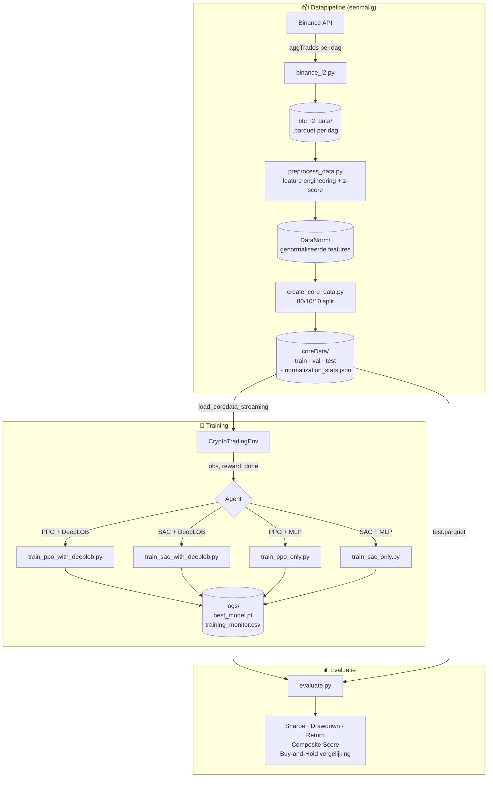
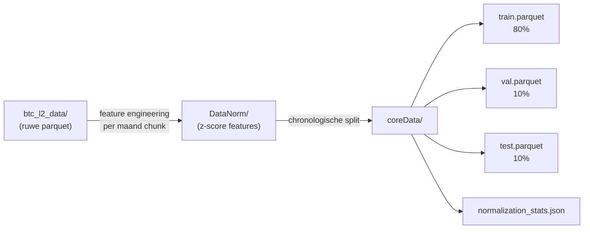
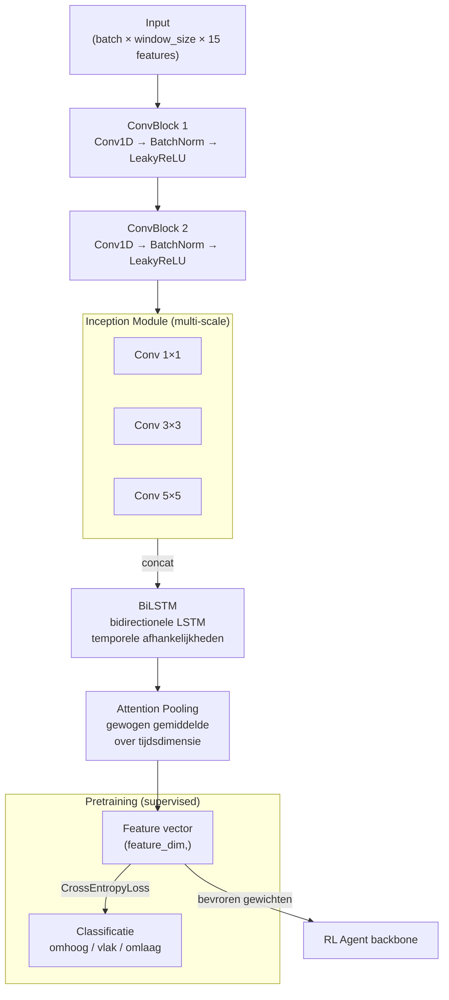
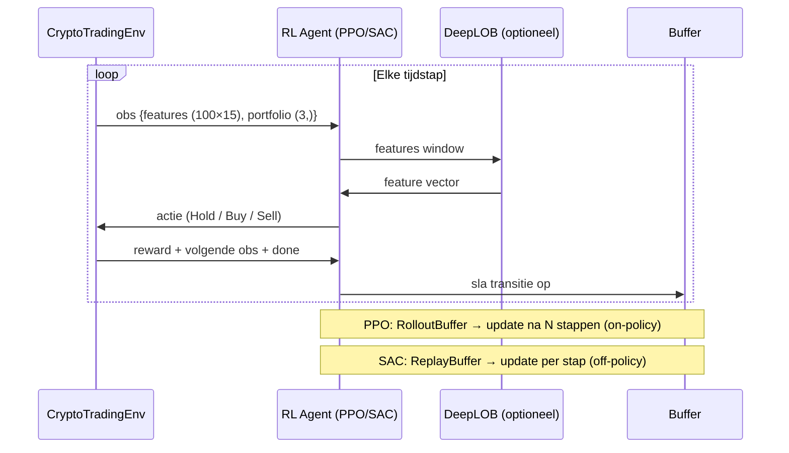
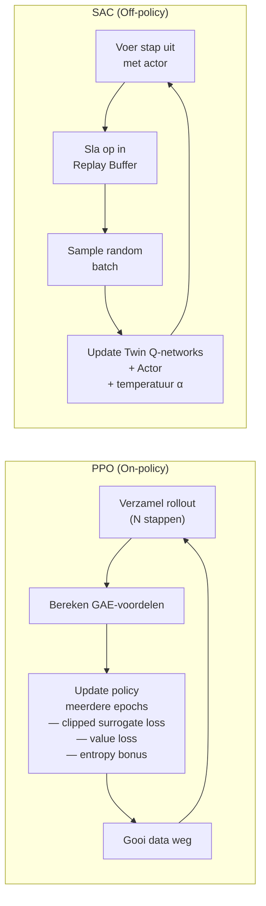
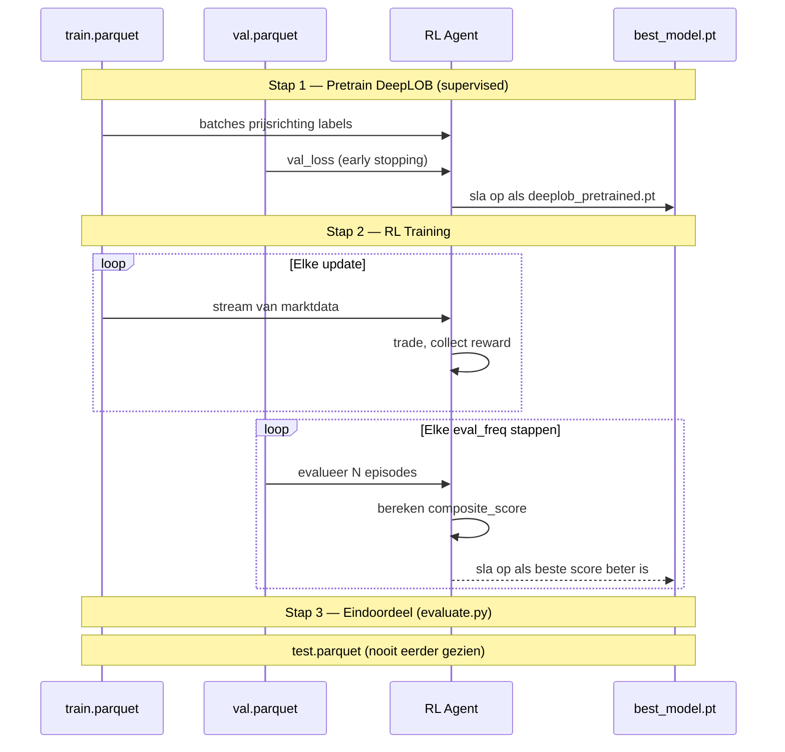
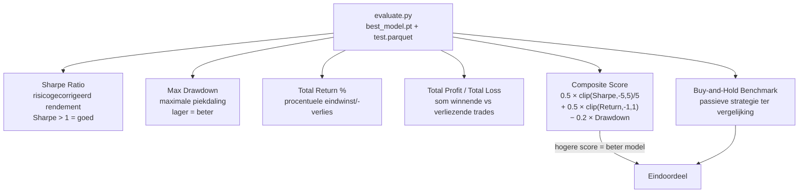

# Software Architectuur — DataDeepRL

## 1. Overzicht

DataDeepRL is een Deep Reinforcement Learning framework voor cryptocurrency trading.
Het systeem combineert een **DeepLOB feature extractor** (CNN + Inception + BiLSTM)
met **PPO** en **SAC** RL-agenten om handelsbeslissingen te nemen op basis van
Binance BTC/USDT L2 order book data.

---

## 2. Systeemoverzicht



---

## 3. Datapipeline



**Features (15 stuks — `STATIONARY_FEATURES`):**

| Categorie | Features |
|---|---|
| Spread | `spread`, `spread_pct` |
| Order flow | `buy_ratio`, `order_imbalance`, `volume_ratio` |
| Returns | `return_5s`, `return_10s`, `return_30s`, `return_60s` |
| Volatiliteit | `volatility_10`, `volatility_30`, `volatility_60` |
| Momentum | `momentum_10`, `momentum_30` |
| Technisch | `rsi_14` |

---

## 4. DeepLOB Architectuur



> Na pretraining worden de gewichten **bevroren** (`--freeze_deeplob`).
> De DeepLOB fungeert daarna puur als feature extractor voor de RL-agent.

---

## 5. RL Agent — Beslissingslus



---

## 6. PPO vs SAC — Algoritme vergelijking



| | PPO | SAC |
|---|---|---|
| Type | On-policy | Off-policy |
| Buffer | RolloutBuffer (weggooi) | ReplayBuffer (bewaar) |
| Sample efficiency | Lager | Hoger |
| Stabiliteit | Hoog | Hoog |
| Exploratie | Entropy bonus | Maximum entropy principe |

---

## 7. Trainingsflow



---

## 8. Data-splitsing en rol per fase

```mermaid
gantt
    title Dataset gebruik per fase
    dateFormat X
    axisFormat %s%%

    section train.parquet (80%)
    RL agent leert strategie       :0, 80

    section val.parquet (10%)
    Checkpoint selectie tijdens training :80, 90

    section test.parquet (10%)
    Eerlijk eindoordeel (scriptie) :90, 100
```



> **Testdata wordt nooit gebruikt tijdens training of modelkeuze.**
> Alleen de testsplit geeft een onbevooroordeeld eindresultaat voor de scriptie.

---

## 9. Evaluatiemetrieken



---

## 10. Ontwerpkeuzes

| Keuze | Motivatie |
|---|---|
| Gesplitste trainingsscripts per variant | Expliciete controle; geen hidden flags; eenvoudiger debuggen |
| Bevroren DeepLOB tijdens RL-training | Voorkomt dat RL de feature-representaties overschrijft; stabielere training |
| On-the-fly windowing in de env | Vermijdt materialisatie van een (N × seq_len × features) array; past in RAM |
| Z-score normalisatie in preprocessing | Stationariteit; vereist door LSTM-gebaseerde modellen |
| Composite score als checkpoint-criterium | Balanceert Sharpe, return én drawdown in één getal voor modelselectie |
| Chronologische split (geen random) | Voorkomt data leakage; respecteert temporele afhankelijkheid van financiële tijdreeksen |
| Inception module (multi-scale conv) | Vangt patronen op korte én lange tijdschalen tegelijk op in het LOB |
| BiLSTM i.p.v. LSTM | Ziet zowel de vorige als de komende context; betere representatie |

---

## 11. Mappenstructuur

```
dataDeepRL/
├── btc_l2_data/            Ruwe Binance L2 parquet (per dag)
├── coreData/               Genormaliseerde train/val/test + normalization_stats.json
├── models/                 Opgeslagen modellen (deeplob_pretrained.pt)
├── logs/                   TensorBoard runs + training_monitor.csv per run
│
├── src/
│   ├── envs/
│   │   ├── trading_env.py  CryptoTradingEnv + FlatCryptoTradingEnv
│   │   └── vec_env.py      VectorizedTradingEnv (N parallelle subprocessen)
│   ├── models/
│   │   ├── deeplob.py      DeepLOB (ConvBlock, Inception, BiLSTM, Attention)
│   │   ├── mlp.py          MLP netwerken (policy, value, actor, critic)
│   │   ├── ppo.py          PPOAgent + RolloutBuffer
│   │   └── sac.py          SACAgent + ReplayBuffer
│   └── utils/
│       ├── logger.py       Training logger
│       ├── callbacks.py    Eval callbacks
│       ├── trade_logger.py Trade-level logging
│       └── mixed_precision.py  AMP support
│
├── train/
│   ├── common/
│   │   └── setup.py        load_coredata_streaming() + STATIONARY_FEATURES
│   ├── train_deeplob_pretrain.py
│   ├── train_ppo_only.py
│   ├── train_sac_only.py
│   ├── train_ppo_with_deeplob.py
│   └── train_sac_with_deeplob.py
│
├── dataVerwerken/
│   ├── preprocess_data.py  Feature engineering + z-score
│   └── create_core_data.py 80/10/10 split
│
├── binance_l2.py           Binance download script
├── evaluate.py             Evalueer model op val/test split
├── tune.py                 Optuna hyperparameter tuning
├── ARCHITECTURE.md         Dit document
└── README.md               Installatie + gebruik
```
