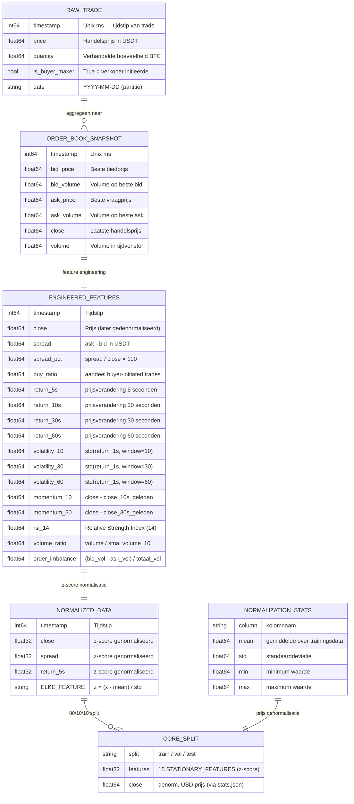
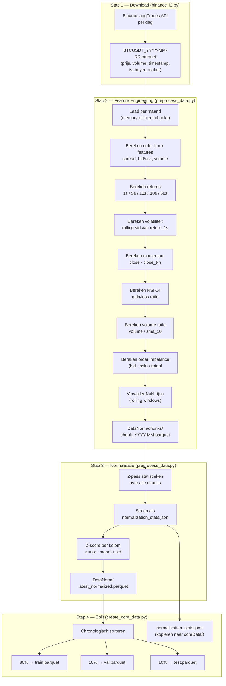
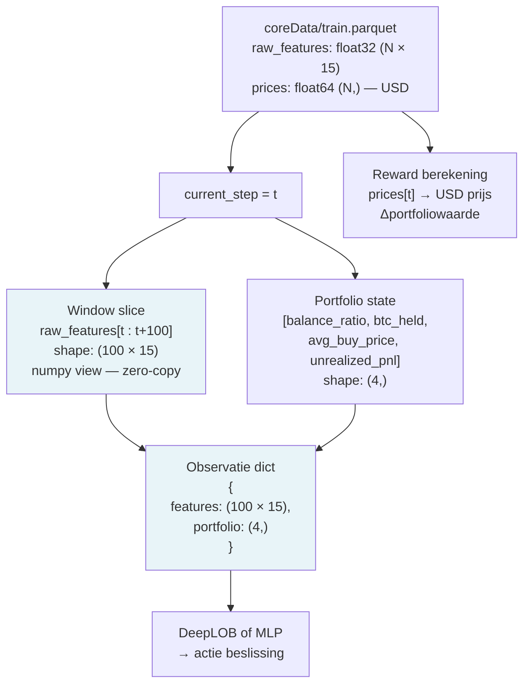
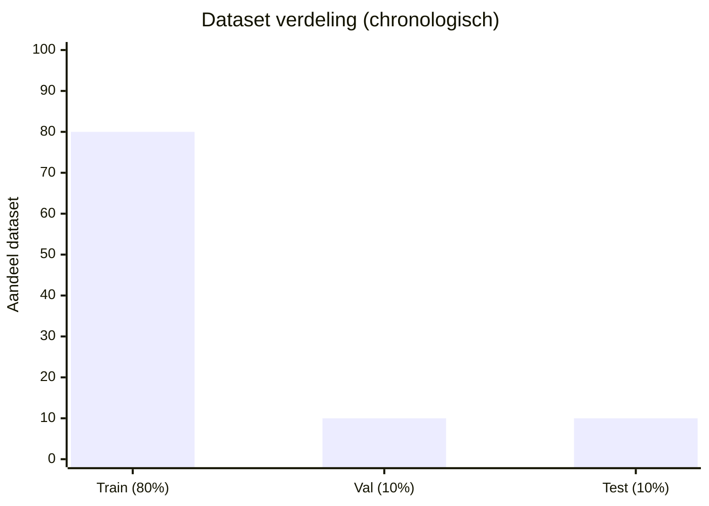
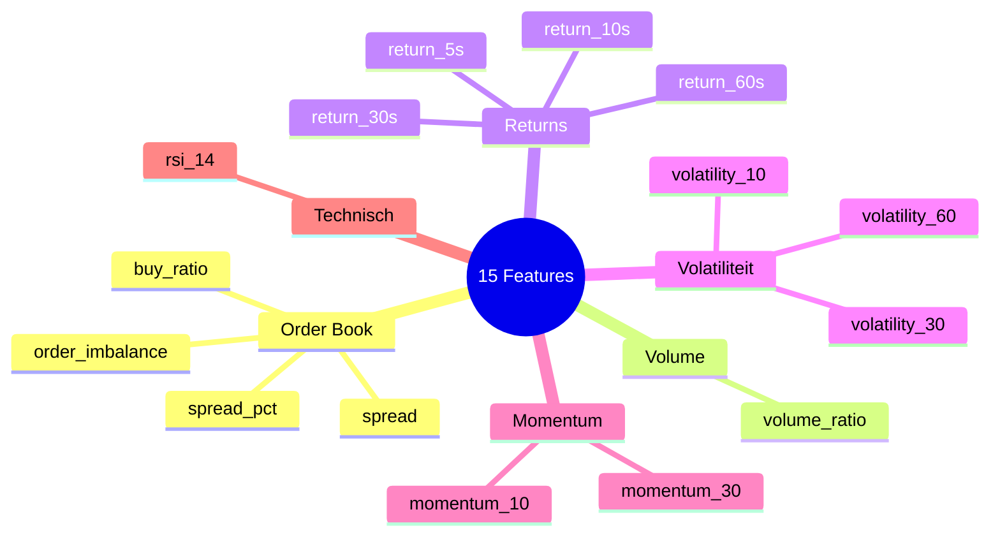
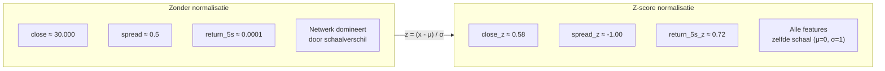
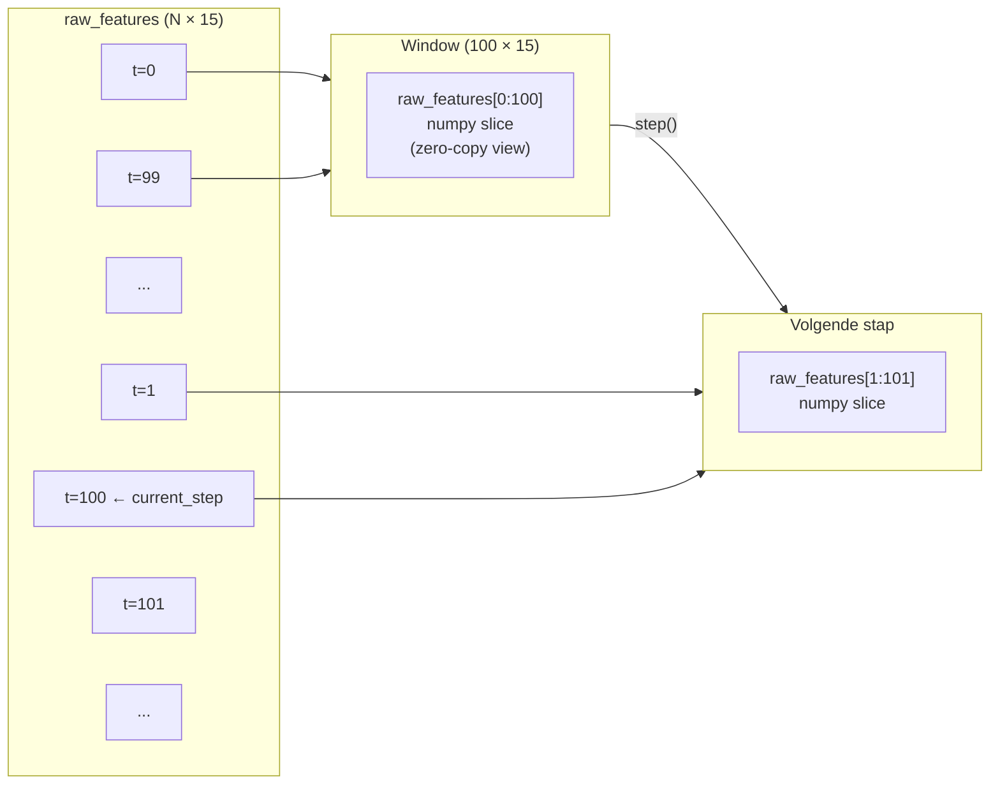
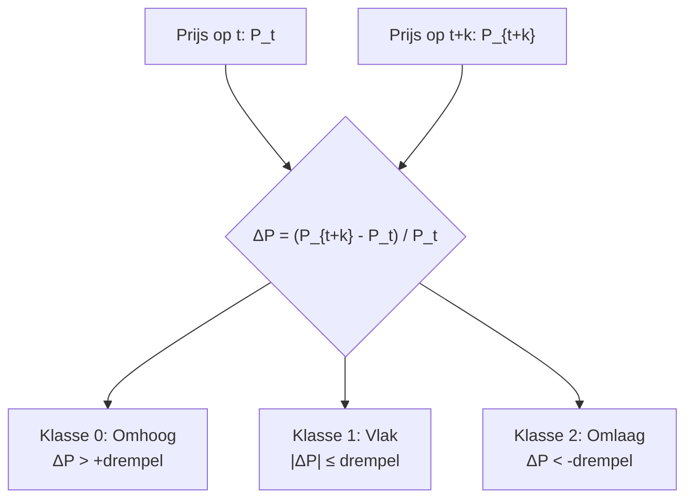
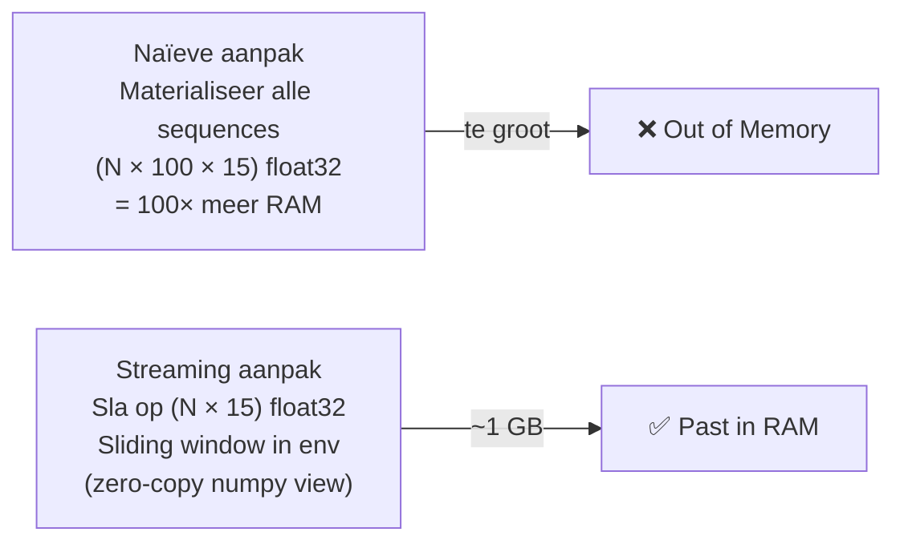

# Datamodel en Data-analyse — DataDeepRL

## 1. Inleiding

Dit document beschrijft het volledige datamodel van DataDeepRL: welke data er
binnenkomt, hoe het wordt verwerkt, welke features worden berekend, hoe de data
wordt opgeslagen en hoe het door het model wordt gebruikt.

---

## 2. Data-entiteiten overzicht



---

## 3. Datapijplijn — transformatiestappen



---

## 4. Feature definities

### 4.1 Ruwe order book features

| Feature | Formule | Eenheid | Betekenis |
|---|---|---|---|
| `spread` | `ask_price - bid_price` | USDT | Kosten om direct te kopen + verkopen |
| `spread_pct` | `spread / close × 100` | % | Spread relatief aan prijs |
| `buy_ratio` | `n_buyer_trades / n_trades` | ratio [0,1] | Vraag druk: hoe meer kopen hoe bullish |
| `order_imbalance` | `(bid_vol - ask_vol) / (bid_vol + ask_vol)` | ratio [-1,1] | Positief = meer koopdruk |
| `volume_ratio` | `volume / sma(volume, 10)` | ratio | Relatief volume t.o.v. gemiddelde |

### 4.2 Prijsverandering (returns)

| Feature | Formule | Venster | Betekenis |
|---|---|---|---|
| `return_5s` | `(close_t - close_{t-5}) / close_{t-5}` | 5 tijdstappen | Korte prijs beweging |
| `return_10s` | `pct_change(10)` | 10 | Medium korte beweging |
| `return_30s` | `pct_change(30)` | 30 | Medium beweging |
| `return_60s` | `pct_change(60)` | 60 | Langere termijn beweging |

### 4.3 Risicofeatures

| Feature | Formule | Venster | Betekenis |
|---|---|---|---|
| `volatility_10` | `std(return_1s, window=10)` | 10 | Kortetermijn onzekerheid |
| `volatility_30` | `std(return_1s, window=30)` | 30 | Mediumtermijn onzekerheid |
| `volatility_60` | `std(return_1s, window=60)` | 60 | Langeretermijn onzekerheid |
| `momentum_10` | `close_t - close_{t-10}` | 10 | Absolute prijsbeweging |
| `momentum_30` | `close_t - close_{t-30}` | 30 | Bredere trend |

### 4.4 Technische indicator

| Feature | Formule | Bereik | Betekenis |
|---|---|---|---|
| `rsi_14` | `100 - 100/(1 + avg_gain/avg_loss)` over 14 perioden | [0, 100] | Overbought (>70) / Oversold (<30) |

---

## 5. Normalisatieschema

```mermaid
flowchart LR
    subgraph RAW["Ruwe waarden"]
        R1["close = 42.000 USD"]
        R2["spread = 0.5 USD"]
        R3["rsi_14 = 65"]
    end

    subgraph STATS["normalization_stats.json"]
        S1["close: mean=35000, std=12000"]
        S2["spread: mean=0.8, std=0.3"]
        S3["rsi_14: mean=50, std=15"]
    end

    subgraph NORM["Z-score output"]
        N1["close_z = (42000-35000)/12000 = +0.58"]
        N2["spread_z = (0.5-0.8)/0.3 = -1.00"]
        N3["rsi_14_z = (65-50)/15 = +1.00"]
    end

    subgraph DENORM["Denormalisatie (bij laden)"]
        D1["prijs_usd = z × std + mean"]
        D1b["= 0.58 × 12000 + 35000 = 41.960 USD"]
    end

    RAW --> STATS
    STATS --> NORM
    NORM -->|"alleen prijs"| DENORM
```



> Features blijven z-score genormaliseerd als modelinput.
> Alleen de `close` prijs wordt teruggedenormaliseerd naar USD — de environment
> heeft de echte USD prijs nodig voor reward berekening en PnL tracking.

---

## 6. Dataschema per fase

### Fase 1 — Ruwe data (`btc_l2_data/`)

```
BTCUSDT_2024-01-15.parquet
├── timestamp     int64    Unix milliseconden
├── price         float64  Handelsprijs USDT
├── quantity      float64  BTC hoeveelheid
├── is_buyer_maker bool    True = verkoper initieerde
└── (eventueel)
    ├── bid_price  float64
    ├── ask_price  float64
    ├── bid_volume float64
    └── ask_volume float64
```

### Fase 2 — Verwerkte data (`DataNorm/`)

```
normalized_20170817_to_20250307.parquet
├── timestamp      int64     Tijdstip
├── close          float32   Z-score (voor denorm naar USD)
├── spread         float32   Z-score
├── spread_pct     float32   Z-score
├── buy_ratio      float32   Z-score
├── return_1s      float32   Z-score  (tussenproduct, niet in model)
├── return_5s      float32   Z-score
├── return_10s     float32   Z-score
├── return_30s     float32   Z-score
├── return_60s     float32   Z-score
├── volatility_10  float32   Z-score
├── volatility_30  float32   Z-score
├── volatility_60  float32   Z-score
├── momentum_10    float32   Z-score
├── momentum_30    float32   Z-score
├── rsi_14         float32   Z-score
├── volume_ratio   float32   Z-score
└── order_imbalance float32  Z-score
```

### Fase 3 — Modelinput (`coreData/`)

```
train.parquet / val.parquet / test.parquet
├── close          float32   Z-score (wordt denorm. bij laden)
├── spread         float32   Z-score ┐
├── spread_pct     float32   Z-score │
├── buy_ratio      float32   Z-score │
├── return_5s      float32   Z-score │  15 STATIONARY_FEATURES
├── return_10s     float32   Z-score │  (modelinput na window slice)
├── return_30s     float32   Z-score │
├── return_60s     float32   Z-score │
├── volatility_10  float32   Z-score │
├── volatility_30  float32   Z-score │
├── volatility_60  float32   Z-score │
├── momentum_10    float32   Z-score │
├── momentum_30    float32   Z-score │
├── rsi_14         float32   Z-score │
├── volume_ratio   float32   Z-score │
└── order_imbalance float32  Z-score ┘

normalization_stats.json
└── stats
    └── close: { mean, std, min, max }
        (alleen close nodig voor denormalisatie)
```

---

## 7. Datatransformatie in de environment



---

## 8. Data-analyse — kenmerken van de dataset

### 8.1 Tijdsbereik en omvang

| Eigenschap | Waarde |
|---|---|
| Bron | Binance BTC/USDT aggTrades |
| Periode | 2017-08-17 t/m 2025-03-07 (~7,5 jaar) |
| Frequentie | Per seconde (geaggregeerd) |
| Bestandsformaat | Apache Parquet (koloms-georiënteerd) |
| Verwerking | Per maand (memory-efficient chunks) |

### 8.2 Datasplitsing



| Split | Aandeel | Tijdperiode | Gebruik |
|---|---|---|---|
| Train | 80% | 2017-08 t/m ~2023-09 | Agent leert strategie |
| Val | 10% | ~2023-09 t/m ~2024-07 | Checkpoint selectie |
| Test | 10% | ~2024-07 t/m 2025-03 | Definitief eindoordeel |

> De split is **chronologisch** — nooit willekeurig. Een willekeurige split zou
> data leakage veroorzaken: toekomstige marktinformatie lekt dan in de training.

### 8.3 Feature categorieën en rationaliteit



### 8.4 Waarom z-score normalisatie?



**Voordelen z-score:**
- LSTM/Conv lagen zijn gevoelig voor schaal — grote waarden domineren anders gradiënten
- Snellere convergentie tijdens training
- Stationariteit: features hebben stabielere statistieken over tijd

### 8.5 Stationariteit — waarom returns ipv absolute prijs?

| Maatstaf | Absoluut (prijs) | Relatief (return) |
|---|---|---|
| BTC prijs 2017 | ~$5.000 | — |
| BTC prijs 2024 | ~$65.000 | — |
| Return 2017 | — | ≈ gelijk aan 2024 |
| Probleem | Model ziet nooit zulke hoge prijzen in training | Geen probleem |
| **Keuze** | ✗ Niet gebruikt als feature | ✓ Gebruikt |

> Absolute prijzen zijn **niet-stationair** — het model zou moeilijk kunnen
> generaliseren van trainingsperiode naar testperiode. Returns en ratio's
> zijn dat wel.

---

## 9. Observatievenster — sliding window mechanisme



- Geen kopie van data — alleen een numpy pointer verschuift
- RAM gebruik: O(N × 15) i.p.v. O(N × 100 × 15) = 100× minder geheugen
- Bij 20M rijen: ~1,1 GB RAM i.p.v. ~110 GB

---

## 10. Portfoliostate als model-input

Naast marktfeatures krijgt het model ook de huidige portfoliostatus als input:

| Veld | Type | Beschrijving |
|---|---|---|
| `balance` | float32 | USDT kasgeld |
| `btc_held` | float32 | Hoeveelheid BTC in bezit |
| `avg_buy_price` | float32 | Gemiddelde inkoopprijs |
| `unrealized_pnl` | float32 | Ongerealiseerde winst/verlies in USDT |

Dit stelt het model in staat om **contextbewuste beslissingen** te nemen:
bijv. niet kopen als al volledig belegd, of verkopen als de PnL positief genoeg is.

---

## 11. Label-definitie voor DeepLOB pretraining

Bij de gesuperviseerde pretraining van DeepLOB worden labels berekend op basis
van toekomstige prijsbeweging:



> Dit is een **3-klassen classificatieprobleem** (omhoog / vlak / omlaag).
> Verliesfunctie: CrossEntropyLoss. Na pretraining wordt alleen de backbone
> (zonder classifier head) gebruikt als feature extractor.

---

## 12. Datavolume en geheugengebruik

| Fase | Formaat | Grootte (schatting) |
|---|---|---|
| `btc_l2_data/` | Parquet per dag | ~50–200 MB per dag × 2.760 dagen |
| `DataNorm/chunks/` | Parquet per maand | ~1–5 GB per maand × 90 maanden |
| `coreData/train.parquet` | Parquet | ~2–8 GB |
| `coreData/val.parquet` | Parquet | ~0.3–1 GB |
| `coreData/test.parquet` | Parquet | ~0.3–1 GB |
| RAM tijdens training | float32 arrays | ~1–3 GB (streaming, geen volledige materialisatie) |

### Geheugenoptimalisatie


