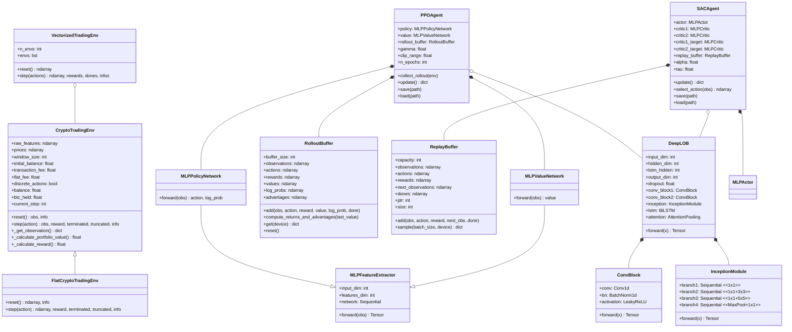
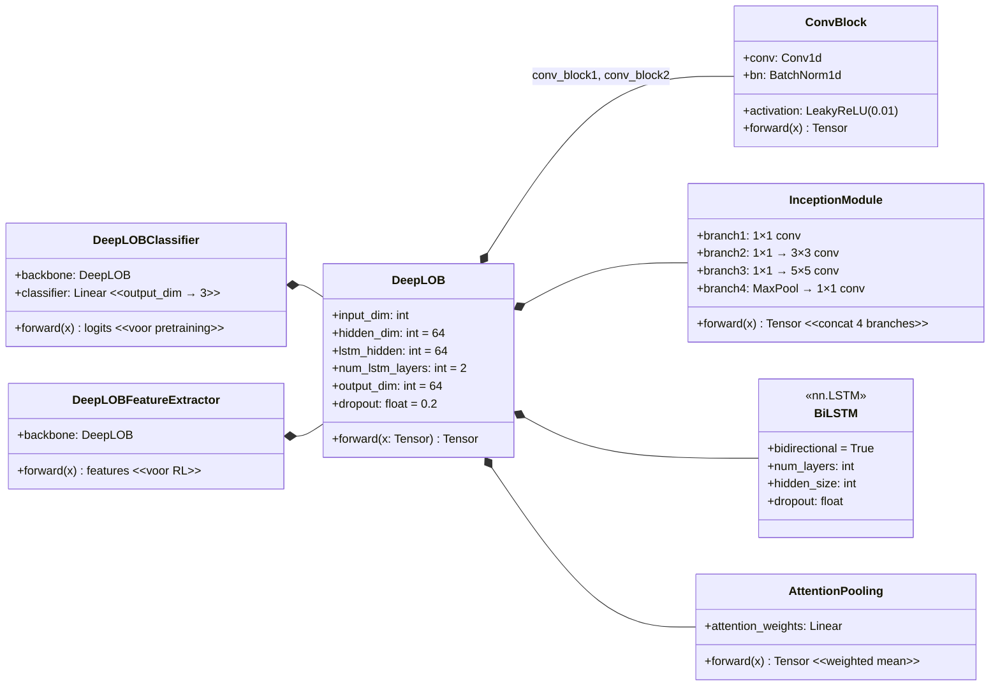
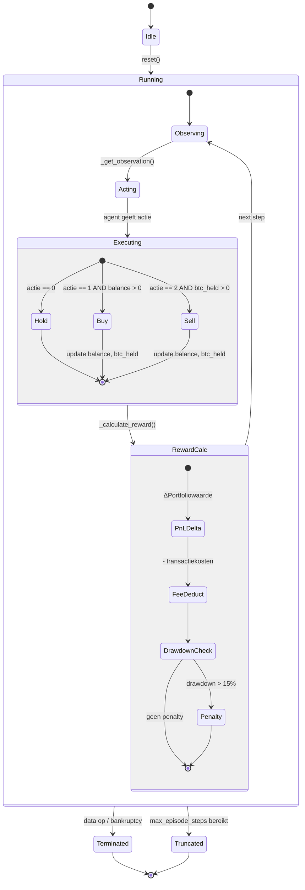
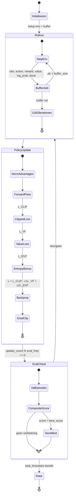
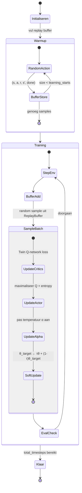
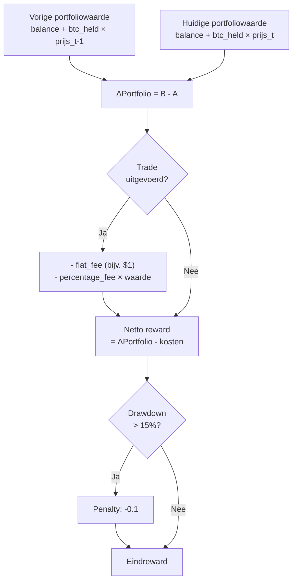
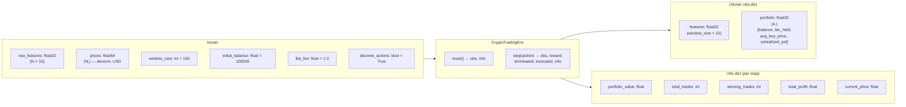
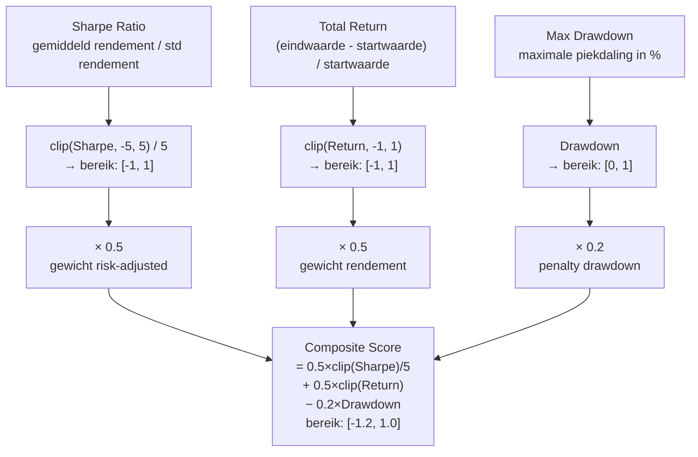

# Software Design Document — DataDeepRL

## 1. Inleiding

Dit document beschrijft het gedetailleerde softwareontwerp van DataDeepRL:
klassendiagrammen, toestandsdiagrammen, datastromen en interfacedefinities.
Het bouwt voort op [ARCHITECTURE.md](ARCHITECTURE.md) en gaat dieper in op
de interne structuur van elke component.

---

## 2. Klassendiagram — Volledig systeem

---

## 3. Klassendiagram — DeepLOB detail

---

## 4. Toestandsdiagram — Trading Environment

---

## 5. Toestandsdiagram — PPO trainingsloop

---

## 6. Toestandsdiagram — SAC trainingsloop

---

## 7. Datastroom — observatie door het netwerk

```mermaid
flowchart LR
    subgraph ENV["CryptoTradingEnv"]
        RF["raw_features\n(N × 15)"]
        WIN["window slice\n(100 × 15)\nnumpy view"]
        PF["portfolio\n(4,)"]
        RF -->|on-the-fly| WIN
    end

    subgraph OBS["Observatie dict"]
        F["features\n(100 × 15)"]
        P["portfolio\n(4,)"]
        WIN --> F
        PF --> P
    end

    subgraph DEEPLOB["DeepLOB (optioneel)"]
        CB["ConvBlocks\n(100 × hidden_dim)"]
        INC["Inception\n(100 × hidden_dim×4)"]
        LSTM["BiLSTM\n(100 × lstm_hidden×2)"]
        ATT["Attention\n(lstm_hidden×2,)"]
        F --> CB --> INC --> LSTM --> ATT
    end

    subgraph MLP["MLP Netwerk"]
        FLAT["flatten + concat\n(feature_vec + portfolio)"]
        H1["Linear → LayerNorm → LeakyReLU"]
        H2["Linear → LayerNorm → LeakyReLU"]
        OUT["feature vector\n(features_dim,)"]
        ATT --> FLAT
        P --> FLAT
        FLAT --> H1 --> H2 --> OUT
    end

    subgraph HEAD["Output Head"]
        POL["Policy Head\n→ actieverdeling"]
        VAL["Value Head\n→ V(s)"]
        OUT --> POL
        OUT --> VAL
    end
```

---

## 8. Datastroom — rewardberekening

---

## 9. Interface — CryptoTradingEnv

---

## 10. Composite Score — berekeningsformule

> Gebruikt voor:
> - **Tijdens training**: checkpoint selectie (`best_model.pt`)
> - **Bij evaluatie**: eindoordeel per episode op testdata

---

## 11. Hyperparameter overzicht

### DeepLOB pretraining

| Parameter | Default | Beschrijving |
|---|---|---|
| `hidden_dim` | 64 | Conv kanalen |
| `lstm_hidden` | 64 | LSTM hidden size |
| `num_lstm_layers` | 2 | Aantal BiLSTM lagen |
| `output_dim` | 64 | Feature vector grootte |
| `dropout` | 0.2 | Regularisatie |
| `lr` | 1e-3 | Learning rate |
| `batch_size` | 512 | Batch grootte |
| `epochs` | 30 | Trainingsepochs |
| `patience` | 1000 | Early stopping |
| `window_size` | 100 | Tijdvenster (tijdstappen) |

### PPO

| Parameter | Default | Beschrijving |
|---|---|---|
| `n_steps` | 2048 | Rollout grootte |
| `n_epochs` | 10 | Update epochs per rollout |
| `batch_size` | 64 | Mini-batch grootte |
| `gamma` | 0.99 | Discount factor |
| `gae_lambda` | 0.95 | GAE lambda |
| `clip_range` | 0.2 | PPO clipping (ε) |
| `lr` | 3e-4 | Learning rate |
| `ent_coef` | 0.01 | Entropy bonus coëfficiënt |
| `vf_coef` | 0.5 | Value loss coëfficiënt |
| `max_grad_norm` | 0.5 | Gradient clipping |

### SAC

| Parameter | Default | Beschrijving |
|---|---|---|
| `buffer_size` | 1_000_000 | Replay buffer capaciteit |
| `batch_size` | 256 | Sample batch grootte |
| `gamma` | 0.99 | Discount factor |
| `tau` | 0.005 | Soft update coëfficiënt |
| `alpha` | 0.2 | Initiële entropie temperatuur |
| `lr_actor` | 3e-4 | Actor learning rate |
| `lr_critic` | 3e-4 | Critic learning rate |
| `learning_starts` | 10_000 | Warmup stappen |
| `train_freq` | 1 | Update elke N stappen |

---

## 12. Ontwerppatronen

| Patroon | Toepassing |
|---|---|
| **Strategy** | `PPOAgent` en `SACAgent` zijn uitwisselbaar via dezelfde `train()`-interface |
| **Decorator** | `FlatCryptoTradingEnv` wraps `CryptoTradingEnv` zonder de logica te dupliceren |
| **Template Method** | Alle trainingsscripts volgen dezelfde structuur: args → env → agent → train loop → eval |
| **Circular Buffer** | `ReplayBuffer` overschrijft oudste entries bij volle capaciteit |
| **Factory** | `load_coredata_streaming()` produceert feature/price arrays voor elke split |
| **Frozen Object** | DeepLOB wordt na pretraining bevroren en puur als feature extractor gebruikt |
